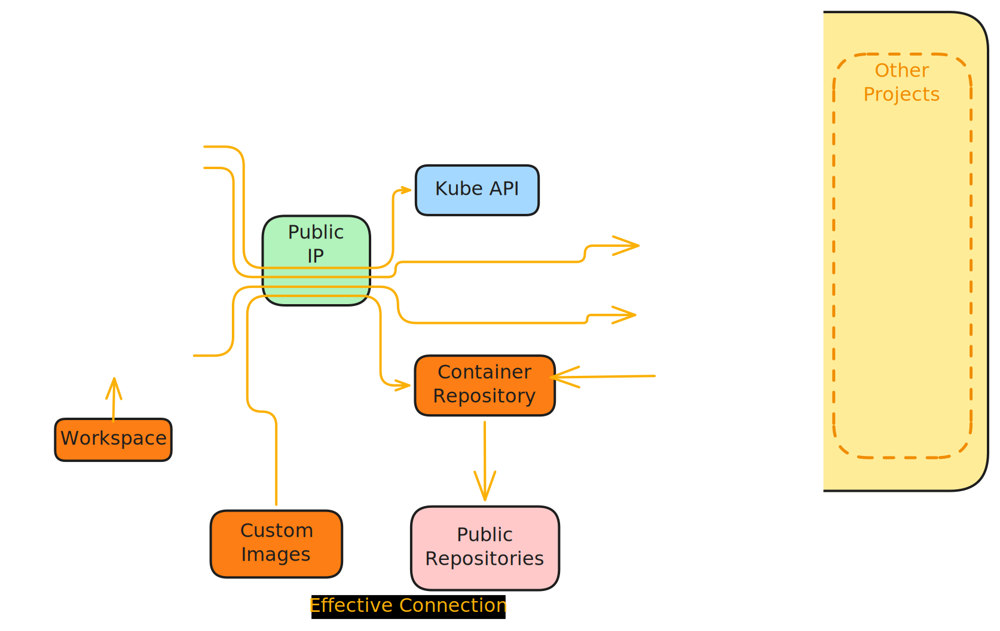

# Architecture

## Tenancy

- For researchers
    - transparent proxy to fridge API
- Security
    - We feel the likelihood of "container breakout" is too high to let pod configuration be the _only_ barrier to privileged host access
        - Arrived at the "two cluster" tenancy
        - Isolated network, is heavily restricted. The _only_ outbound connection possible is to the container repository, to fetch container images
            - No other "external" connection (_e.g._ internet)
            - No access to other machines, VMs, nodes, in the target infrastructure/cloud
    - Separation of "admin" and "researcher" areas
        - different proxies
        - possible to isolate the TRE operators from TRE researchers
    - Defence in depth
        - at K8s
            - PSS
            - Network (Cilium)
            - RBAC
            - Data-at-rest encryption (protects from bad actors, compromise at infrastructure provider)
        - at infrastructure
            - network (vnet) isolation (out of band!)
        - Compromising the host is very unlikely
            - And even if it does happen, and privilege escalation occurs, there is no access to other networks
            - No access to data from other projects
            - The worst that can happen is a researcher trashes their own environment
    - Connection between TRE and FRIDGE
        - pub/private key

## FRIDGE internal

- Update figure to cover access/isolated clusters, remove unused components
- Access cluster
    - user stuff
        - kube proxy (sshd)
        - FRIDGE proxy (sshd)
        - container repository (harbor)
    - others
        - Network policy (cilium)
- Isolated cluster
    - user stuff
        - FRIDGE API (fast api)
        - workflow manager (argo workloads)
        - job namespace
        - object storage (minio)
        - block storage (longhorn/CSI driver PVCs)
    - others
        - Network policy (cilium)
