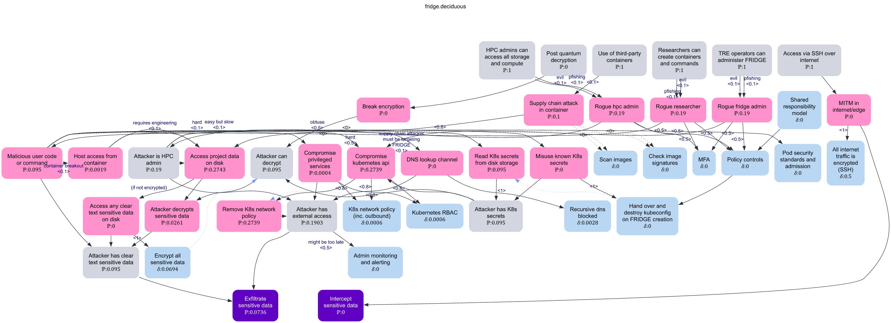

# FRIDGE Attack Tree

This folder contains an attack tree model for FRIDGE, to inform security controls.

The primary reason for attack tree modeling FRIDGE is to understand how risks can be mitigated with a combination of HPC facility and FRIDGE security controls, and thus define the required security posture for the HPC tenancies.

An "attack tree" represents the combinatorial means by which an attacker might try to achieve their goals. The tool used is [Deciduous](https://kellyshortridge.com/blog/posts/deciduous-attack-tree-app/), with modifications [developed at UCL](https://github.com/gsvarovsky/deciduous) to allow calculation of the risks associated with `attacks` and affected by `mitigations`.

The attack tree models the attacker goals of exfiltrating or intercepting sensitive data:

- The source code for this generated image is [fridge.deciduous.yaml](./fridge.deciduous.yaml).
- Risk effects generally assume a motivated attacker, the risk of an attack reflecting its practical difficulty.
- The risk probability shown in the model assumes a continuous 0..1 scale. Due to current [limitations](https://github.com/gsvarovsky/deciduous/issues) of the tool, these values are primarily prompts for discussion.
- Discussions were conducted at two workshops with the FRIDGE team.

## Findings

These findings represent highlights from the attack tree modeling discussions.

1. Any persistent storage of encryption keys in the HPC environment, even if encrypted, is subject to attack by a rogue HPC administrator, because they have higher privilege than any component in their environment. Strictly, this is even true of keys in memory, although an attack may then be infeasible. Recommended solutions:
   - Use an external key store, access to which requires multi-party approval
     (such as EntraID Privileged Identity Management)
   - Inject encryption keys so that they need not be persisted, e.g. at node start (requiring a restart procedure), or via the API (noting that the API is well-protected by TRE-to-boundary SSH, and SSL encryption)
   - Apply TRE-grade policy, procedure and technical controls to HPC administration
2. Generally, malware in containers has limited effect due to network policies and RBAC - even if the malware is insider-created, collusion is required with a local administrator to exploit an egress channel. This also limits the need to scan images and/or check image signatures.
   - Container breakout generally has the same profile, but may allow an attacker to exploit other workloads on the HPC facility, including other instances of FRIDGE, for an egress channel, without the need to collude with an administrator.
